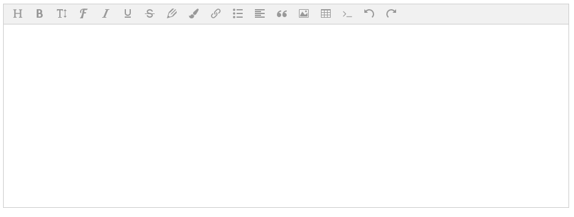
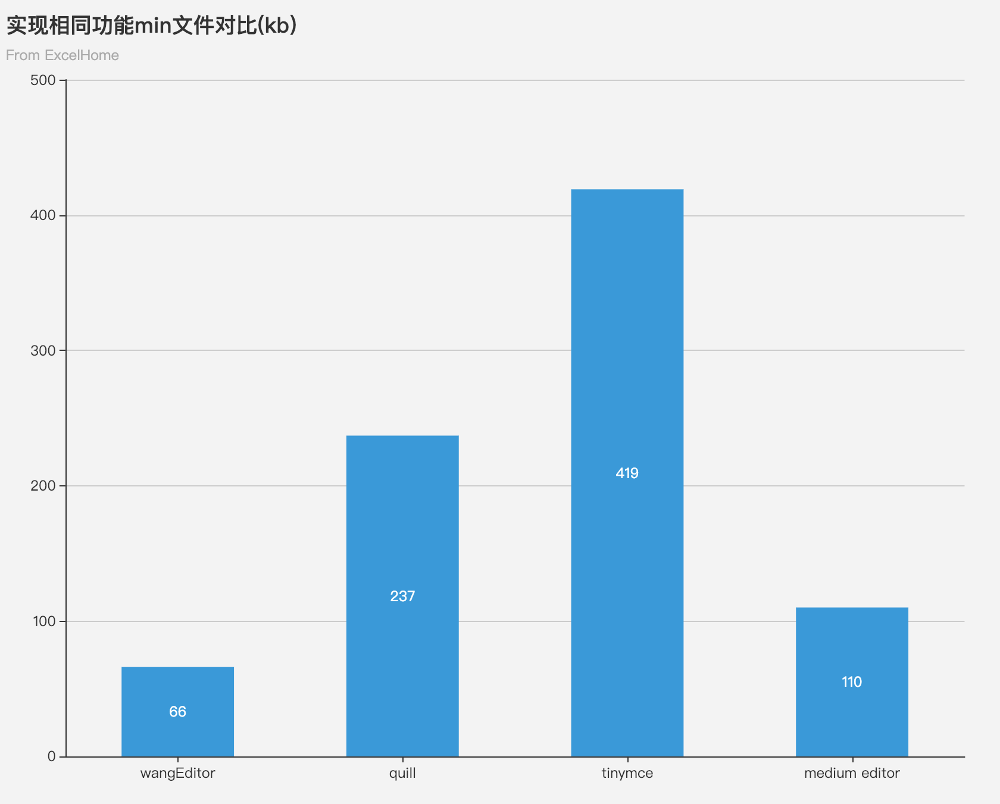

# v-editor

根据 [wangEditor][wangeditor] 以及 [upload-to-ali][] 封装的轻量级富文本编辑器。



## Table of Contents

* **[Introduction](#introduction)**
* **[Feature](#feature)**
* **[Documentation](#documentation)**
* **[Pre install](#pre-install)**
* **[Install](#install)**
* **[Quick Start](#quick-start)**
* **[Props](#props)**
* **[Methods](#methods)**
* **[Events](#events)**
* **[Slots](#slots)**
* **[Dev](#dev)**
* **[License](#license)**

## Introduction

公司内部对于富文本组件的需求比较简单：简单的图文编排。

因此选型富文本组件主要考虑：

### 组件大小

倾向于最轻量的富文本编辑器。

选型对比了业界比较出名（开源 star 比较高）的组件：quill，wangEditor,tinymce-vue,medium editor。



[⬆ Back to Top](#table-of-contents)

### OSS 文件上传

搭载 [upload-to-ai][upload-to-ali] 组件，富文本组件能自动将图片上传到 oss，避免图片信息以 base64 编码形式保存在内容中，有效压缩文本信息。

[⬆ Back to Top](#table-of-contents)

## Feature

* **轻量**：最小的富文本编辑器，[组件选型范围](https://mubu.com/doc/sA3r4QKBK0) 参考了（quill,tinymce-vue,medium editor）
* **oss 上传**：整合了上传组件，只需配置 OSS 的基本信息([配置参考][upload-to-ali])，即可将图片上传到 oss，避免图片信息以 base64 编码形式保存在内容中，文本内容偏大

[⬆ Back to Top](#table-of-contents)

## Documentation

* [online demo](https://femessage.github.io/v-editor/storybook/)

[⬆ Back to Top](#table-of-contents)

## Pre install

```
yarn add @femessage/upload-to-ali
```

[⬆ Back to Top](#table-of-contents)

## Install

```
yarn add @femessage/v-editor
```

[⬆ Back to Top](#table-of-contents)

## Quick start

```
//step1 确保oss配置

//step2 在需要使用该渲染器的.vue文件中
<template>
  <v-editor v-model="content"/>
</template>

<script>
import VEditor from '@femessage/v-editor'
export default {
  name: 'my-page',
  components: {
    VEditor
  },
  data(){
    return {
      content:''
    }
  }
}
</script>
```

[⬆ Back to Top](#table-of-contents)

## Props

| 参数          | 说明                                                       | 类型    | 默认值                   |
| ------------- | ---------------------------------------------------------- | ------- | ------------------------ |
| uploadOptions | 可自定义[upload-to-ali]上的所有属性                        | Object  | {}                       |
| editorOptions | 可自定义[wangEditor] 部分参数，例子如下：{debug:false, menus: ['head']} | Object  | **[defaultEditorOptions](#defaultEditorOptions)**  |
| disabled      | 编辑器是否可编辑                                           | Boolean | false                    |
| height        | 编辑器高度，单位**px**                                     | Number  | 400                      |

### defaultEditorOptions（默认编辑器参数）

| 参数            | 说明                                                    | 类型    | 默认值                                                                                                                                                                  |
| --------------- | ------------------------------------------------------- | ------- | ----------------------------------------------------------------------------------------------------------------------------------------------------------------------- |
| debug           | debug 模式下，有 JS 错误会以 throw Error 方式提示出来。 | Boolean | false                                                                                                                                                                   |
| onchangeTimeout | 自定义 onchange 触发的延迟时间，单位 **ms**             | Number  | 200                                                                                                                                                                    |
| menus           | 默认菜单配置                                            | Array   | ["head","bold","fontSize","fontName","italic","underline","strikeThrough","foreColor","backColor","link","list","justify","quote","image","table","code","undo","redo"] |

[⬆ Back to Top](#table-of-contents)

## Methods

| 方法      | 说明                                                           | 返回值      |
| --------- | -------------------------------------------------------------- | ----------- |
| getEditor | 返回的是 wangEditor 对象，用于调用[wangEditor api][wangeditor] | editor 对象 |

[⬆ Back to Top](#table-of-contents)

## Events

| 事件           | 说明                             | 回调参数   |
| -------------- | -------------------------------- | ---------- |
| upload-loading | 可监听并增加上传 loading 交互    | 是否加载中 |
| upload-error   | 可监听并增加上传错误时的提醒交互 | -          |

[⬆ Back to Top](#table-of-contents)

## Slots

| 插槽    | 说明           |
| ------- | -------------- |
| loading | 自定义上传文本 |

[⬆ Back to Top](#table-of-contents)

## Dev

install dependency

```
yarn

yarn add @femessage/upload-to-ali -P
```

run dev story

```
yarn story
```

publish to npm

```

yarn dist

cd dist

npm publish --access public
```

[⬆ Back to Top](#table-of-contents)

## License

[MIT](./LICENSE)

[⬆ Back to Top](#table-of-contents)

[upload-to-ali]: https://github.com/FEMessage/upload-to-ali 'upload-to-ali'
[wangeditor]: https://github.com/wangfupeng1988/wangEditor 'wangEditor'
